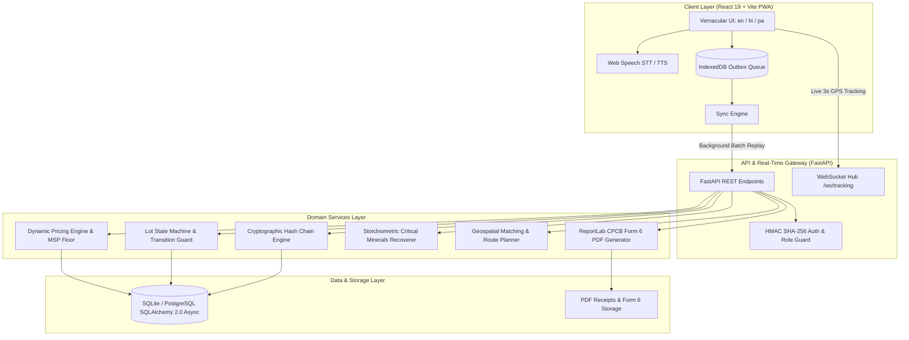
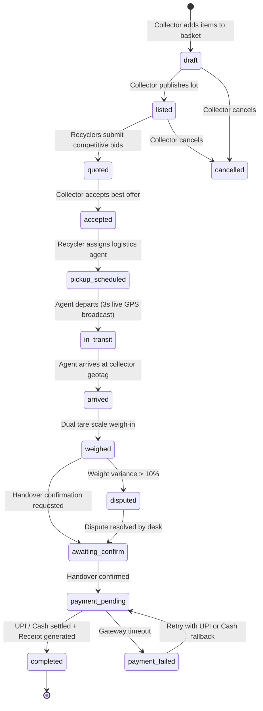

# System Architecture & Technical Specification

**Project**: Kabadiwala Connect  
**Hackathon**: Smart India Hackathon 2026 (PS SIH26229)  
**Nodal Agency**: Ministry of Mines & JNARDDC (Jawaharlal Nehru Aluminium Research Development and Design Centre)

---

## 1. High-Level Architecture Diagram

---

## 2. Lot State Machine Lifecycle

The lot lifecycle strictly enforces valid state transitions. Unauthorized transitions are rejected with HTTP 409 Conflict.

---

## 3. Cryptographic Hash Chain Audit Trail

Every physical handover is anchored into a sequential, tamper-evident SHA-256 hash chain:

$$H_0 = \text{"0000000000000000000000000000000000000000000000000000000000000000"}$$

$$H_i = \text{SHA256}(H_{i-1} \parallel \text{seq}_i \parallel \text{event\_type}_i \parallel \text{canonical\_json}(\text{payload}_i) \parallel \text{iso8601}(\text{timestamp}_i))$$

### Verification Guarantee
- If any actor attempts to modify weights, UPI transaction references, or GPS coordinates in the database retroactively, $H_i \neq \text{SHA256}(\dots)$ and the verification endpoint (`/api/lots/{id}/trace/verify`) immediately returns `valid: false` with `broken_at_seq: i`.
- The Admin Portal provides judges with live **"Simulate Tampering"** and **"Repair Chain"** buttons to observe this cryptographic resilience in real time.

---

## 4. Offline Outbox Architecture

For rural and low-connectivity scrap yards:
1. When offline (or when simulated via the top offline bar), mutations (`POST /lots`, `POST /basket`, etc.) are intercepted by `api.ts`.
2. The mutation is saved into browser IndexedDB under the `outbox` object store with a client-generated UUID.
3. The UI receives an optimistic success response (`queued_offline`), allowing the collector to continue work uninterrupted.
4. When connectivity resumes (`window.addEventListener('online')` or manual trigger), the outbox engine sends a batch request to `/api/sync/batch`.
5. The backend commits actions atomically and updates status.

---

## 5. Critical Minerals Recovery Intelligence

Stoichiometric recovery calculations are derived from JNARDDC scientific characterization data:

| E-Waste Material Category | Strategic Elements Recoverable | Yield (g/kg) | Strategic Application |
|---|---|---|---|
| **Printed Circuit Boards (PCB)** | Copper (Cu), Gold (Au), Silver (Ag), Tin (Sn), Palladium (Pd) | Cu: 160g, Au: 0.25g, Ag: 1.0g, Sn: 30g, Pd: 0.05g | Defence electronics & renewable power |
| **Lithium-Ion Battery Packs** | Lithium (Li), Cobalt (Co), Nickel (Ni) | Li: 28g, Co: 95g, Ni: 120g | EV supply chain self-reliance |
| **Hard Drive Magnets** | Neodymium (Nd), Dysprosium (Dy), Iron (Fe) | Nd: 280g, Dy: 15g, Fe: 640g | Wind turbines & electric motors |
| **Copper Cables & Wire** | Refined Electrolytic Copper (Cu) | Cu: 620g | Grid infrastructure |

The National Admin Dashboard computes live kilograms of strategic elements recovered, benchmarked against national import substitution targets.
