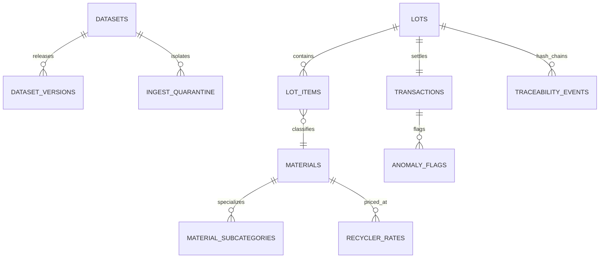

# Living Dataset Pipeline & Data Architecture Specification
**Smart India Hackathon 2026 — PS SIH26229**  
**Ministry of Mines & JNARDDC | Kabadiwala Connect**

---

## 1. Overview & Regulatory Context

Under **Problem Statement SIH26229**, Kabadiwala Connect establishes a **Living Data Pipeline** capturing real-world e-waste material flows, informal sector price dynamics, and critical mineral recovery rates.

The data infrastructure complies with:
1. **Digital Personal Data Protection Act (DPDPA), 2023** — strict data minimization, coarse geolocation, no avatars, and zero storage of national identity numbers (Aadhaar / PAN).
2. **E-Waste (Management) Rules, 2022** — automated generation and verification of Form 6 transit manifests and recycling certificates.

---

## 2. Core Schemas & Entity Relationship

### 2.1 Living Dataset Entities
- **`datasets`**: Master catalog registered under Ministry of Mines / JNARDDC stewardship.
- **`dataset_versions`**: Semantically versioned snapshots (e.g. `v1.0-seed`, `v1.1-pilot`) containing row counts, date bounds, synthetic share %, and SHA-256 checksums.
- **`ingest_quarantine`**: Quarantine table holding unverified, anomalous, or malformed data records for human review before training set ingestion.
- **`training_labels`**: Verified image-to-material annotations used for continuous learning.
- **`anomaly_flags`**: Statistical outliers detected by MAD z-score (>2.5), weight variance (>15%), or velocity limits.

---

## 3. Provenance & Synthetic Data Flagging

Every transaction and scrap lot in the database maintains two immutable provenance fields:
- **`source`** (`String(50)`):
  - `"platform"`: Native transaction generated through collector app.
  - `"field_research"`: Collected on-site during pilot research interviews.
  - `"cpcb_portal"`: Public reference rates synchronized from government portals.
  - `"synthetic_seed"`: Bootstrap simulation data for hackathon evaluation.
- **`is_synthetic`** (`Boolean`):
  - `True`: Generated by seeding scripts to simulate production scale.
  - `False`: Authentically recorded from physical field collection points.

The Admin Data Health panel continuously monitors and displays the **Synthetic Share %** to ensure transparency.

---

## 4. Anonymization & Privacy Specification (HMAC-SHA256)

When datasets are exported for research or regulatory reporting via `/api/admin/export-anonymized-csv`:
1. **Phone Numbers:**  
   Hashed using HMAC-SHA256 with a secure server-side salt:
   $$\text{PhoneHash} = \text{HMAC-SHA256}(\text{Salt}, \text{PhoneNumber})[0:12]$$
   Example: `9811002233` $\rightarrow$ `HASH-d8a2f7c01b4e`.
2. **Coarse Geolocation:**  
   Precise latitude/longitude coordinates are truncated to **2 decimal places** ($\approx 1.1 \text{ km}$ precision), masking exact residence or micro-shop locations while preserving municipal cluster resolution.
3. **Identity Exclusion:**  
   Zero personal names, photos, bank account numbers, or Aadhaar numbers are included in public exports.
