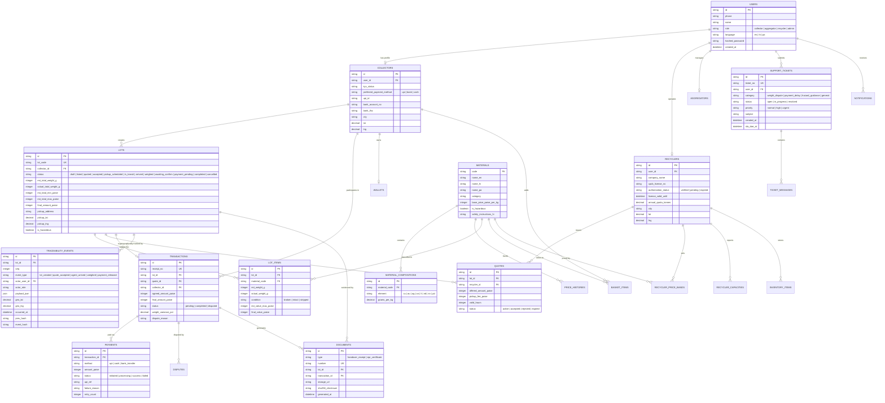

# Entity Relationship (ER) Diagram

```mermaid
erDiagram
    USERS ||--o| COLLECTORS : "has profile"
    USERS ||--o| RECYCLERS : "operates"
    USERS ||--o| AGGREGATORS : "manages"
    USERS ||--o{ SUPPORT_TICKETS : "submits"
    USERS ||--o{ NOTIFICATIONS : "receives"

    COLLECTORS ||--o{ LOTS : "creates"
    COLLECTORS ||--o{ TRANSACTIONS : "participates in"
    COLLECTORS ||--o| WALLETS : "owns"
    COLLECTORS ||--o{ BASKET_ITEMS : "adds"

    RECYCLERS ||--o{ QUOTES : "issues"
    RECYCLERS ||--o{ RECYCLER_PRICE_BANDS : "sets"
    RECYCLERS ||--o{ RECYCLER_CAPACITIES : "reports"
    RECYCLERS ||--o{ INVENTORY_ITEMS : "stores"

    MATERIALS ||--o{ MATERIAL_COMPOSITIONS : "contains"
    MATERIALS ||--o{ PRICE_HISTORIES : "tracks"
    MATERIALS ||--o{ LOT_ITEMS : "classified in"
    MATERIALS ||--o{ BASKET_ITEMS : "refers to"
    MATERIALS ||--o{ RECYCLER_PRICE_BANDS : "priced by"

    LOTS ||--o{ LOT_ITEMS : "composed of"
    LOTS ||--o{ QUOTES : "receives"
    LOTS ||--o| TRANSACTIONS : "settles into"
    LOTS ||--o{ TRACEABILITY_EVENTS : "cryptographically tracked by"
    LOTS ||--o{ DOCUMENTS : "evidenced by"

    TRANSACTIONS ||--o{ PAYMENTS : "paid via"
    TRANSACTIONS ||--o{ DISPUTES : "disputed by"
    TRANSACTIONS ||--o{ DOCUMENTS : "generates"

    SUPPORT_TICKETS ||--o{ TICKET_MESSAGES : "contains"

    USERS {
        string id PK
        string phone
        string name
        string role "collector | aggregator | recycler | admin"
        string language "en | hi | pa"
        string hashed_password
        datetime created_at
    }

    COLLECTORS {
        string id PK
        string user_id FK
        string kyc_status
        string preferred_payment_method "upi | bank | cash"
        string upi_id
        string bank_account_no
        string bank_ifsc
        string city
        decimal lat
        decimal lng
    }

    RECYCLERS {
        string id PK
        string user_id FK
        string company_name
        string cpcb_license_no
        string authorization_status "verified | pending | expired"
        datetime license_valid_until
        decimal annual_quota_tonnes
        string city
        decimal lat
        decimal lng
    }

    MATERIALS {
        string code PK
        string name_en
        string name_hi
        string name_pa
        string category
        integer base_price_paise_per_kg
        boolean is_hazardous
        string safety_instructions_hi
    }

    MATERIAL_COMPOSITIONS {
        string id PK
        string material_code FK
        string element "cu | au | ag | co | li | nd | sn | pd"
        decimal grams_per_kg
    }

    LOTS {
        string id PK
        string lot_code UK
        string collector_id FK
        string status "draft | listed | quoted | accepted | pickup_scheduled | in_transit | arrived | weighed | awaiting_confirm | payment_pending | completed | cancelled"
        integer est_total_weight_g
        integer actual_total_weight_g
        integer est_total_min_paise
        integer est_total_max_paise
        integer final_amount_paise
        string pickup_address
        decimal pickup_lat
        decimal pickup_lng
        boolean is_hazardous
    }

    LOT_ITEMS {
        string id PK
        string lot_id FK
        string material_code FK
        integer est_weight_g
        integer actual_weight_g
        string condition "broken | intact | stripped"
        integer est_value_max_paise
        integer final_value_paise
    }

    QUOTES {
        string id PK
        string lot_id FK
        string recycler_id FK
        integer offered_amount_paise
        integer pickup_fee_paise
        integer valid_hours
        string status "active | accepted | rejected | expired"
    }

    TRANSACTIONS {
        string id PK
        string receipt_no UK
        string lot_id FK
        string quote_id FK
        string collector_id FK
        integer agreed_amount_paise
        integer final_amount_paise
        string status "pending | completed | disputed"
        decimal weight_variance_pct
        string dispute_reason
    }

    TRACEABILITY_EVENTS {
        string id PK
        string lot_id FK
        integer seq
        string event_type "lot_created | quote_accepted | agent_arrived | weighed | payment_released"
        string actor_user_id FK
        string actor_role
        json payload_json
        decimal geo_lat
        decimal geo_lng
        datetime occurred_at
        string prev_hash
        string event_hash
    }

    PAYMENTS {
        string id PK
        string transaction_id FK
        string method "upi | cash | bank_transfer"
        integer amount_paise
        string status "initiated | processing | success | failed"
        string upi_ref
        string failure_reason
        integer retry_count
    }

    DOCUMENTS {
        string id PK
        string type "handover_receipt | epr_certificate"
        string number UK
        string lot_id FK
        string transaction_id FK
        string storage_url
        string sha256_checksum
        datetime generated_at
    }

    SUPPORT_TICKETS {
        string id PK
        string ticket_no UK
        string user_id FK
        string category "weight_dispute | payment_delay | hazard_guidance | general"
        string status "open | in_progress | resolved"
        string priority "normal | high | urgent"
        string subject
        datetime created_at
        datetime sla_due_at
    }
```
